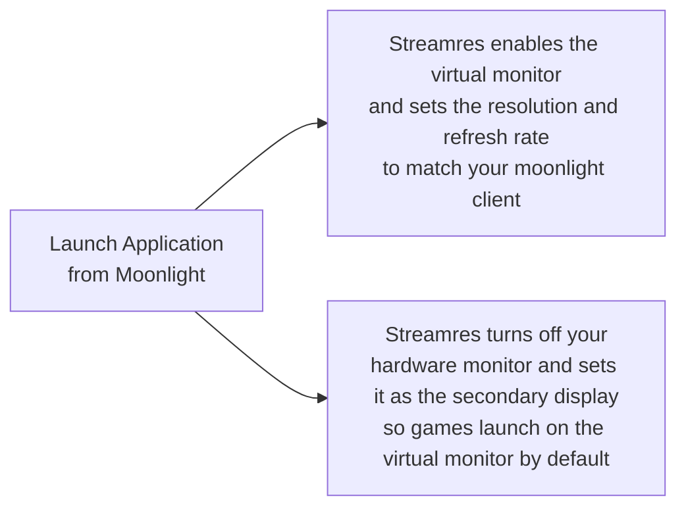
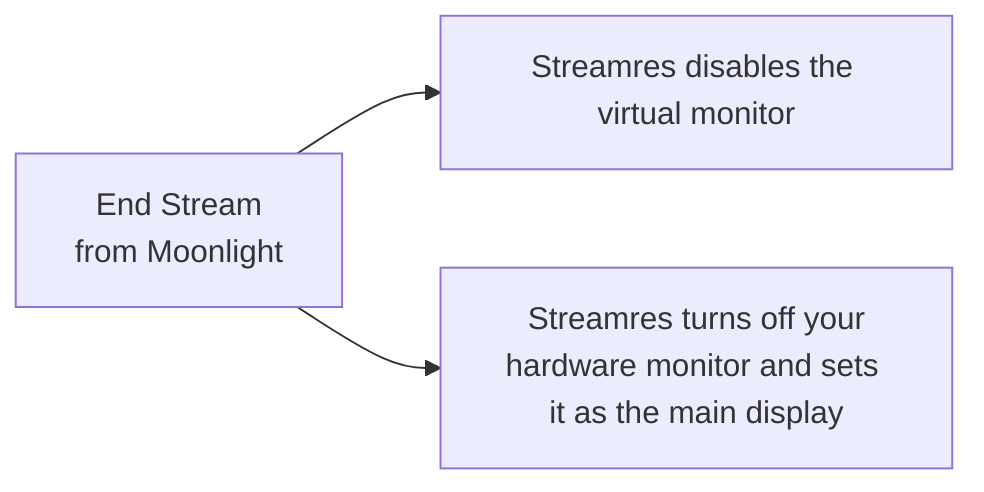

# Streamres

Streamres simplifies streaming via Sunshine on Windows.
It manages virtual monitors and sets the resolutions and refresh rates to match the connecting client device.

This allows you to stream at resolutions or refresh rates that your connected hardware monitor may not support. eg: You
can use 4K@60FPS when you only have a 1080p monitor but stream to a 4K TV

## NOTE

This has now been made largely redundant by https://github.com/LizardByte/Sunshine/releases/tag/v2025.118.151840
and https://github.com/LizardByte/libdisplaydevice
which included display switching built into Sunshine for Windows.

This may serve some use for Linux if a few window specific commands are modified, otherwise I'll Archive it if Sunshine
devs add linux support to their display device switcher.

## Requirements

### Sunshine

This is designed to be used by Sunshine https://github.com/LizardByte/Sunshine

### Virtual Display Driver

Before anything else, first install Virtual Display Driver according to the
installation instructions. Follow the step by step guide at this
link https://github.com/VirtualDisplay/Virtual-Display-Driver?tab=readme-ov-file#%EF%B8%8F-installation

This is used to create a fake virtual display so the streaming host can display resolutions and refresh rates that are
unsupported by your
physical monitors. This virtual display will be disabled by the streamres tool when not in use.

## Installation

### Automated Installation

Run streamres from your command line. eg: Command Prompt and trigger the `install` command.

eg:

```
./streamres.exe install
```

When running this from a command prompt or powershell terminal you will be prompted to give
streamres admin privileges.

These are required for the `install` command as streamres will copy itself to the Sunshine install folder, and update
sunshine's conf file to add streamres to the global prep commands whenever a stream is started. As Sunshine is usually
installed in a protected folder this requires admin privileges.

### Manual Installation

If you would prefer not to give streamres admin privileges to install you can perform the installation actions yourself
manually.

#### 1

First copy this exe into the `Program Files\Sunshine\tools` folder, make sure it is named `streamres.exe`, rename it if
required.

#### 2

To integrate this tool with Sunshine stream via Moonlight clients. Open the Sunshine Web UI, navigate to "Configuration"
and add the following into the "Command Preparations" section to run them before each script. And then click "Save"

| ▶ config.do_cmd                                                                                                                                                | ⎌ config.undo_cmd                                             |
|----------------------------------------------------------------------------------------------------------------------------------------------------------------|---------------------------------------------------------------|
| cmd /C "C:\Program Files\Sunshine\tools\streamres.exe" start --height %SUNSHINE_CLIENT_HEIGHT% --width %SUNSHINE_CLIENT_WIDTH% --refresh %SUNSHINE_CLIENT_FPS% | cmd /C "C:\Program Files\Sunshine\tools\streamres.exe" revert |
| timeout /t 3                                                                                                                                                   |                                                               |

The timeout command is optional. I find it's best to wait a few seconds after switching monitors and resolutions to let
everything "settle" before launching the stream and the selected application to prevent things "jumping around" when
first loading.

## How It Works

### On



### Off



## CLI Commands

Use `streamres -h` to get more information on CLI commands. But the basics are below

`streamres -v` can be run for all commands to enable verbose debug logging. This can help with pinpointing the cause of
issues.

### Start

`streamres start` will switch your primary monitor over to the virtual monitor installed by the Virtual Display Driver
and set the resolution to 1920x1080@60fps by default. To modify the resolution and refresh rate use the `--height`
`--width` and `--refresh` flags.

eg: `streamres start --width 3840 --height 2160 --refresh 60`

The `start` command stores your current monitor configuration before changing anything.

### Revert

`streamres revert` will switch your monitors back to the state they were before you last ran the `start` command. This
can be used when ending a stream and wanting to switch back to using hardware monitors.

### Install

`streamres install` will automatically install Streamres and update sunshine to use it. This command is idempotent so
don't worry about accidentally re-running it.

Actions taken during install are:

- Create cache directory and copy embedded dependencies over there
- Copy streamres executable into the `Sunshine/tools` folder
- Update Sunshine's config file `Sunshine/config/sunshine.conf` to add streamres to the global commands for all
  streaming sessions

### Uninstall

`streamres uninstall` reverts the actions taken by `streamres install` to remove it from your PC as much as possible.

It is **NOT** recommended that you run this while streaming, otherwise you will be responsible for reverting the virutal
display and re-enabling your hardware display on stream end.

### Embedded dependencies

#### [Multi Monitor tool](https://www.nirsoft.net/utils/multi_monitor_tool.html)

This tool bundles and utilises the existing work of the
freeware [NirSoft MultiMonitor tool]((https://www.nirsoft.net/utils/multi_monitor_tool.html)).

This is used to enable the virtual monitor, set the required resolution and refresh rate, and turn off any hardware
monitors while not in use. You do not need to download this, it is included in this tool and installed automatically.

## Cleanup

If you want to remove this tool completely from your system, it also creates an application folder under
%localappdata%/Streamres where the multi monitor tool and configuration files are stored.

Either delete this folder manually or run streamres uninstall to remove it via the CLI tool before deleting the EXE


